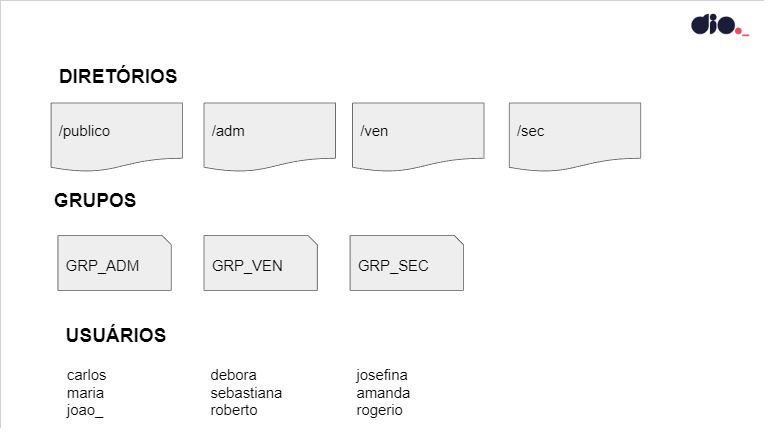

# linux-experience-bootcamp-project1
1° projeto do bootcamp Linux Experience.

## Objetivo
Criar um script em que toda a infraestrutura de usuários, grupos de usuários, diretórios e permissões serão criadas automaticamente. Será realizado o upload do arquivo de script no GitHub para futuras reutilizações do script. Sendo assim, toda nova máquina virtual que for iniciada já estará pronta para uso quando o script for executado.

 

## Escopo

 

## Especificações

- Todo provisionamento deve ser feito em um arquivo do tipo Bash Script;
- O dono de todos os diretórios criados será o usuário root;
- Todos os usuários terão permissão total dentro do diretório publico;
- Os usuários de cada grupo terão permissão total dentro de seu respectivo diretório;
- Os usuários não poderão ter permissão de leitura, escrita e execução em diretórios de departamentos que eles não pertencem;

